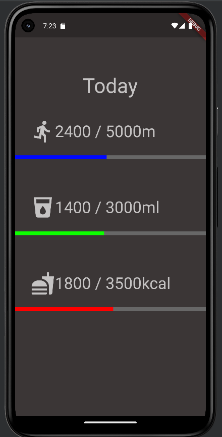

<h1 align="center" id="title">Fitness-Tracker</h1>

Ein kleines Projekt um die täglichen Fitness-Fortschritte zu tracken. Dieses Projekt dient hauptsächlich zur Übung für den Einstieg in Flutter und ist nicht besonders nützlich.

  
  
<h2>🧐 Features</h2>

*   Tracken der Anzahl der gegessenen Kalorien des getrunkenen Wassers und der gelaufenen Schritte
*   Unendliche Scroll-Funktion
*   Click-Events
*   Progress Bar

<h2>Preview</h2>

